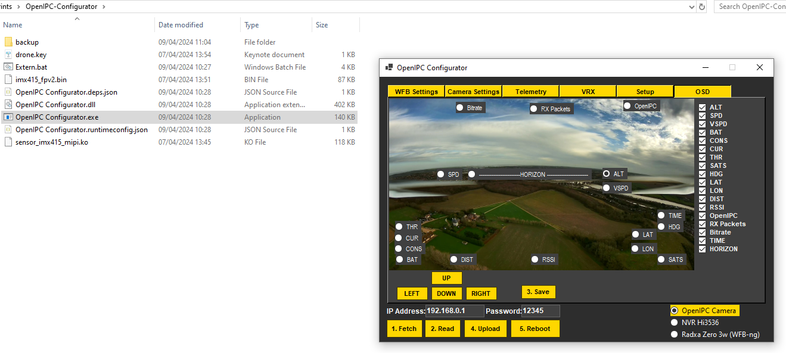

# OpenIPC Configurator

OpenIPC Configurator for setting up FPV and URLLC devices

*This is a work in progress.*

Idea was to create a multiplatform application that can run anywhere (Windows, Mac or Linux).


## Setup


### Windows

Please download and install PuTTy before running the Configurator

---

Run the "OpenIPC Configurator.exe" file.

Enter the IP of the camera/NVR/Radxa Zero 3w.

Click Fetch to receive the setting files.

Then click Read to read the current settings.

Edit the settings.

Then click Save.

Then click Upload to send the settings to the camera/NVR/Radxa Zero 3w.




#### Ubuntu

sudo apt install libgbm1 libasound2


headless setup x11
Install Xvfb:
```bash
sudo apt-get install xvfb
```
Start Xvfb:
```bash
Xvfb :99 -screen 0 1024x768x24 &
```

Set the DISPLAY Variable:
```bash
export DISPLAY=:99
```

Setup
```bash
npm install
```

Run Your Electron App:

```bash
npm start
```

## Build
npm run build

## Debug


## Running dependencies

sshpass